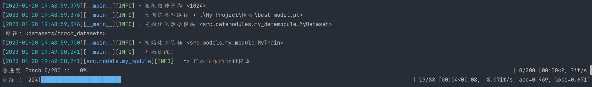

<div align="center">

# Pytorch-Hydra 模板 
<a href="https://pytorch.org/get-started/locally/"></a>
<a href="https://hydra.cc/"></a>
[](https://papers.nips.cc/book/advances-in-neural-information-processing-systems-31-2018)
[](https://papers.nips.cc/book/advances-in-neural-information-processing-systems-31-2018)
[](https://papers.nips.cc/book/advances-in-neural-information-processing-systems-31-2018)  
<!--ARXIV[](https://www.nature.com/articles/nature14539)-->

</div>
 
## 项目描述
基于Pytorch和Hydra实现的训练测试模板 


## 如何运行   
第一步，安装依赖  
```bash
# 克隆项目   
git clone https://github.com/SindreYang/pytorch-hydra-template

# 安装依赖   
cd pytorch-hydra-template
pip install -r requirements.txt
```

使用默认配置训练模型

```bash
python main.py
```

选择实验配置[configs/my_envs/](configs/my_envs/)训练模型 

```bash
python main.py my_envs=experiment_name.yaml
```

您可以像这样从命令行覆盖任何参数

```bash
python main.py my_envs.train.epochs=20
```


## 设置为包，方便导入
此项目设置为一个包，这意味着您现在可以轻松地将任何文件导入到任何其他文件中，如下所示：
```bash
pip install -e .
```


## 项目结构

```
├── configs                   <- Hydra 配置文件
│   ├── my_envs                  <- 实验配置
│   ├── hparams_search           <- 超参数搜索配置
│   └── experiment.yaml          <- 主要配置
│
├── datasets                   <- 训练数据
│
├── logs                   <- Hydra 和 PyTorch 记录器生成的日志
│
├── scripts                <- Shell 脚本
│
├── src                    <- 源代码
│   ├── datamodules              <- 数据模块
│   ├── models                   <- 模型
│   └── utils                    <- 工具脚本
│
│
├── main.py                <- 训练and测试
│
├── requirements.txt          <- 用于安装 python 依赖项的文件
├── setup.py                  <- 打包成pip安装包
└── README.md
```

<br>

